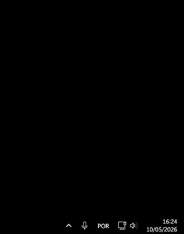

# Lighthouse

A temporary and self-hosted file-receiving station. Run it, share your address, receive files, shut it down.



## Concept

Lighthouse removes the usual friction from receiving files from someone:

- No port forwarding
- No cloud storage accounts
- No server setup
- No file size limits

You spin it up, choose your transport layer, and share the address with whoever needs to send you files. They upload. You download. Shut it down.

## How it works

Lighthouse supports two transport modes:

**Tor (default)** — creates a hidden service and gives you an `.onion` address. Your IP stays hidden. Works without a public IP or open ports. Slower.

**Cloudflare Tunnel (`--tunnel`)** — exposes Lighthouse via a Cloudflare-issued public URL. Faster, but Cloudflare sits in the middle of the traffic.

```
# Tor mode
Sender (Tor Browser) ──► Tor network ──► Lighthouse (your machine)

# Tunnel mode
Sender (any browser) ──► Cloudflare Tunnel ──► Lighthouse (your machine)
```

## Stack

- **Frontend** — React + TypeScript (Vite, TanStack Router, Tailwind CSS)
- **Backend** — Go (Gin), proxied at `/api/`
- **Storage** — MinIO (S3-compatible object storage)
- **Transport** — Tor hidden service or Cloudflare Tunnel

On **Linux and macOS**, everything runs in Docker. On **Windows**, all components run natively — no Docker required.

## Installation

### Linux / macOS

Requires Docker and Docker Compose.

```bash
curl -fsSL https://github.com/neozmmv/Lighthouse/releases/latest/download/install.sh | sh
```

### Windows

Download and run `LighthouseSetup.exe` from the [releases page](https://github.com/neozmmv/Lighthouse/releases/latest). The installer adds `lighthouse` to your PATH automatically.

### Manual (Linux / macOS)

Download the binary for your platform from the [releases page](https://github.com/neozmmv/Lighthouse/releases/latest), make it executable and move it to your PATH:

```bash
chmod +x lighthouse-linux-amd64
sudo mv lighthouse-linux-amd64 /usr/local/bin/lighthouse
```

## Usage

### Start

```bash
lighthouse up
```

On first run, Lighthouse sets itself up automatically — no configuration needed.

By default, Lighthouse uses Tor as its transport. To expose it via a Cloudflare Tunnel instead:

```bash
lighthouse up --tunnel
```

> **Note:** `--tunnel` trades anonymity for speed. Cloudflare will see transfer metadata (IPs, timestamps, file sizes). Use Tor mode if anonymity matters.

### Get your onion address

Your `.onion` address remains the same, you get it with this command:

```bash
lighthouse url
```

In tunnel mode, your `trycloudflare.com` address will appear in your terminal once you start it with the `--tunnel` flag.

### Check status

```bash
lighthouse status
```

### List received files

```bash
lighthouse files
```

### Download a file

```bash
lighthouse download 0
lighthouse download 0 --here      # save to current directory instead of ~/Downloads
lighthouse download 0 --remove    # delete from bucket after downloading
```

### Stop

```bash
lighthouse down
```

## Accessing the web interface

|                     | Linux / macOS           | Windows                 |
| ------------------- | ----------------------- | ----------------------- |
| **Main interface**  | `http://localhost`      | `http://localhost:8080` |
| **File management** | `http://localhost:4405` | `http://localhost:4405` |
| **MinIO console**   | `http://localhost:9001` | `http://localhost:9001` |

On **Linux/macOS**, MinIO credentials default to `lighthouse` / `lighthouse_secret`. You can override them by creating a `.env` file in `~/.lighthouse/` before first run:

```
MINIO_ROOT_USER=yourUser
MINIO_ROOT_PASSWORD=yourPassword
```

On **Windows**, credentials are generated automatically on first run and stored in `%APPDATA%\lighthouse\config.json`.

## Updating

**Linux / macOS:**

```bash
lighthouse update
```

Updates the CLI binary, `docker-compose.yml`, `Caddyfile`, and pulls the latest Docker images. If Lighthouse is running, restart it to apply the changes.

**Windows:**

Download and run the latest `LighthouseSetup.exe` from the [releases page](https://github.com/neozmmv/Lighthouse/releases/latest).

## Uninstall

**Linux / macOS:**

```bash
curl -fsSL https://github.com/neozmmv/Lighthouse/releases/latest/download/uninstall.sh | sh
```

**Windows:**

Use **Add or remove programs** in Windows Settings.

## Support the project!

If you find Lighthouse useful, consider supporting development:

<p align="center">
  
  <br/>
  <code>bc1qzvmxmc3t5fwvuqamufa6s73dfr7c2p90t3vdpu</code>
</p>

<!-- **Bitcoin:** `bc1qzvmxmc3t5fwvuqamufa6s73dfr7c2p90t3vdpu` -->

## Project structure

```
lighthouse/
├── backend-go/   # Go API (Gin + MinIO)
├── cli/          # Go CLI
└── frontend/     # React app
```

## Development

**Dependencies (Linux / macOS):**

```bash
docker compose -f docker-compose.dev.yml up -d
```

**Frontend:**

```bash
cd frontend
npm install
npm run dev
```

**Backend:**

```bash
cd backend-go
go run .
```
